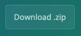

**Où:** Salle TD5.129 

**Quand:** Du 12 octobre 2023 au 7 décembre 2023

**Instructeurs:** 
[Sandra Cortijo](mailto:sandra.cortijo@cnrs.fr), 
[Océane Cassan](mailto:Oceane.CASSAN@cnrs.fr)

## Description

Ce cours va vous apprendre comment explorer des données et réaliser des graphiques dans **R**. 

Afin de pouvoir faire ce cours sur votre ordinateur, téléchargez le matériel du cours en cliquant sur  et dézippez le dossier téléchargé. Ce dossier contient les données ainsi que le matériel vous permettant de mettre en pratique le cours et de faire les exercices.

Les différentes séances sont (avec accès au cours):

### Séance 1 (12/10/2023 13h15-16h30, salle TD5.129): Organisation des données et intro à **R**

[Matériel organisation des données](session1_organisation/materiel/organisation_session.html)  

[Solution des exercices](session1_organisation/materiel/organisation_session_solution_exercices.html)

 

[Matériel intro à R](session1_organisation/materiel/intro_R.html)  

[Solution des exercices](session1_organisation/materiel/intro_R_solution_exercices)

 

### Séance 2 (19/10/2023 13h15-16h30, salle TD5.129): Réaliser des graphiques

[Matériel réaliser des graphiques](session2_ggplot/materiel/ggplot_session.html)  

[Solution des exercices](session2_ggplot/materiel/ggplot_exercise_solutions.html)

 

### Séance 3 (26/10/2023 13h15-16h30, salle TD5.129): Ajouter des résultats de tests statistiques à des graphiques et réorganiser des données

[Partie 1 - Matériel ajouter des résultats de tests statistiques à des graphiques](session3_stats_reorganisation/materiel/statistiques.html)  

[Solution des exercices](session3_stats_reorganisation/materiel/statistiques_solution_exercices.html)  

 

[Partie 2 - Matériel réorganisation de données](session3_stats_reorganisation/materiel/reorganisation_donnees.html)  

[Solution des exercices](session3_stats_reorganisation/materiel/reorganisation_donnees_solution_exercices.html)

 

### Séance 4 (8/11/2023 13h15-16h30, salle TD5.129): Réorganisation de données - suite

[Matériel réorganisation de données - suite](session4_reorganisation_suite/materiel/reorganisation_suite.html)  

[Solution des exercices](session4_reorganisation_suite/materiel/reorganisation_suite_solution_exercices.html)

 

### Séance 5 (13/11/2023 13h15-16h30, salle TD5.129): Réorganisation avancée de données

[Matériel réorganisation de données avancée](session5_reorganisation_avancee/materiel/reorganisation_avancee.html) 

[Solution des exercices](session5_reorganisation_avancee/materiel/reorganisation_avancee_solution_exercices.html)

 

### Séance 6 (20/11/2023 13h15-16h30, salle TD5.129): Exam blanc, Correction de l'exam blanc et trucs et astuces

### Séance 7 (7/12/2023 9h45-11h15, salle TD5.129): Exam

 

### BONUS

[Créer un Rmarkdown](Rmarkdown/materiel/rmarkdown_session.html) 

[Solution des exercices - Créer un Rmarkdown](Rmarkdown/materiel/Solution.html)

 

### Liens  utiles

[Antisèches](https://www.rstudio.com/resources/cheatsheets/)

 

## Modalités d'évaluation

**L'évaluation de cette matière va comporter:**

**1. Un contrôle continu qui combine les exercices à faire entre les séances sur votre ordinateur personnel. Une première moitié du contrôle continu sera à déposer sur Moodle au plus tard le 7/11/2023 à minuit. La deuxième moitié sera à déposer sur Moodle au plus tard le 26/11/2023 à minuit.**

**2. Un devoir en classe lors de la dernière séance**

 

## Pour utiliser R chez vous: 
Il est recommandé d'utiliser R régulièrement pour bien comprendre et apprendre. Pour cela le mieux est d'installer **R** et **R studio** sur votre ordinateur:

[Installer R](https://cran.biotools.fr/)

[Installer Rstudio](https://rstudio.com/products/rstudio/download/)

Dans chaque cas, téléchargez la version pour votre système opérateur (Mac, Windows ou Linux) et installez les programmes normalement.

Vous devez aussi avoir les packages `tidyverse`, `visdat` et `plotly` installés. 
Pour cela:
1. Assurez vous d'avoir accès à internet
2. Ouvrez Rstudio
3. Dans la "console" (panel en haut à gauche), tapez `install.packages(c("tidyverse","visdat", "plotly"))` puis enter
4. Assurez vous que l'installation a fonctionné en tapant `library(tidyverse)` (puis faites la même chose avec `visdat` et `plotly`)
5. Le message affiché doit être similaire à la capture d'écran ci-dessous. Si vous avez un message du type: 
"Error in library(tidyverse): there is no package called 'tidyverse'"
**contactez un des instructeurs**.

