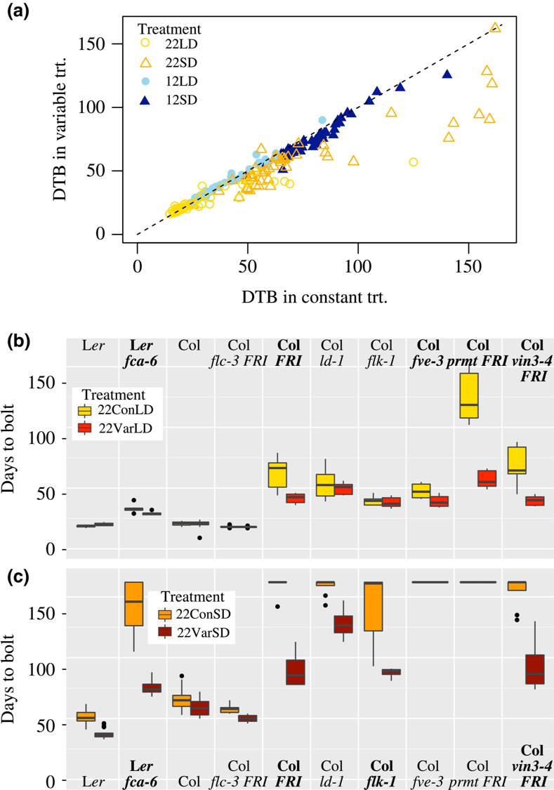

```{r setup, include=FALSE}
knitr::opts_chunk$set(echo = TRUE)
```

[Retour à la page d'accueil](https://scortijo.github.io/2022_L3_R/)

# Visualisation de données avec ggplot2

Lors de cette séance nous allons apprendre à visualiser des jeux de données tabulaires avec [``ggplot2``](http://ggplot2.org/).

Pour cette formation, nous allons utiliser une version légèrement modifiée du jeu de données publié par [Burghard et al 2015](http://datadryad.org/resource/doi:10.5061/dryad.65d76). 

Il s'agit d'une expérience de phénotypage de plantes d'*Arabidopsis thaliana* qui ont poussé dans différentes conditions:

- A 12°C ou à 22°C
- Avec une température constante ou qui fluctue dans la journée
- Avec une période de 8h de jour ou de 16h de jour par cycle de 24h
- Avec un traitement de froid qui imite l'hiver (vernalisation)

Des plantes de différents génotypes ont été analysées: des mutants et sauvages et des écotypes différents.

Pour chaque plante dans chaque condition plusieurs phénotypes ont été mesurés (voir illustration ci-dessous pour mieux comprendre les termes):

- Le nombre de jour pour que la tige (qui contient les fleurs) émerge: _days to bolt_
- Le nombre de jour pour que la première fleur s'ouvre: _days to flower_
- Le nombre de feuilles dans la rosette à la fin de l'expérience: _rosette leaf num_
- Le nombre de feuilles caulines à la fin de l’expérience: _cauline leaf num_
- La longueur du limbe de la feuille: _blade lenght mm_
- La longueur de la feuille (avec le pétiole et le limbe) _total leaf length mm_

{width=70%} 

# Quels types de graphiques pouvons nous faire avec ggplot2?


Il est possible de représenter les données de différentes manières et ggplot2 offre de nombreuses options de visualisation.

Parmi les plus connues:

- [Des barplots](https://www.r-graph-gallery.com/barplot.html) 

- [Des boxplots](https://www.r-graph-gallery.com/boxplot.html) 

- [Des histogrammes](https://www.r-graph-gallery.com/histogram.html) 

Et encore plus. Pour toutes les découvrir, voir [cette galerie de graphiques avec ggplot2](https://www.r-graph-gallery.com/index.html)


# Mise en place


Ouvrez avec `Rstudio` le fichier `Script_ggplot_lesson.R` qui est dans le répertoire `session2_ggplot/materiel`.

Lors de cette séance nous allons utiliser plusieurs packages qui contiennent les fonctions dont nous avons besoin:  
- `tidyverse` qui contient plusieurs packages dont `ggplot2`  
- `visdat`  qui permet une représentation rapide des données  
- `plotly` pour faire des graphiques interactifs  


Ces packages sont normalement déjà installés. Pour les importer dans votre session, utilisez la fonction ``library()`` : 

```{r load packages, eval = TRUE, message = FALSE}
library(tidyverse)
library(visdat)
library(plotly)
```

Vous devez aussi vous assurer que le répertoire de travail de R est bien le dossier qui contient le matériel de la formation. Le chemin vers ce dossier va être différent en fonction de votre système opérateur.   
Pour spécifier le répertoire de travail de R utilisez la fonction ``setwd()``:

``` {r, eval = FALSE}
setwd("~/Desktop/2021_L3_R/session2_ggplot/materiel")
```


# Import et vérification des données

Ouvrez avec `Rstudio` le fichier `Script_ggplot_session.R` qui est dans le répertoire `session2_ggplot/materiel`. Nous allons coder ensemble dans ce script, qui est quasiment vide pour le moment. 


La version simplifiée des données est dans le dossier ``session2_ggplot/data`` (`burghardt_et_al_2015_expt1.txt`). Il s'agit de données pour des phénotypes associés au temps nécessaire à des plantes de différents génotypes pour fleurir dans différentes conditions.

Comme notre répertoire de travail est le dossier `materiel` , nous devons importer les données ainsi:

```{r read data}
# Import des données et chargement dans l'objet expt1 
expt1 <- read_tsv("../data/burghardt_et_al_2015_expt1.txt")
```

La fonction `read_tsv()` imprime un message indiquant quel type de données sont contenues dans les différentes colonnes du fichier. 

Dans notre cas, certaines colonnes contiennent des données de type "character" (du texte) et d'autres des données numériques ("double" en présence de décimale, "integer" en absence de décimale).


Pour regarder rapidement les données, tapez le nom de l'objet où sont les données (`expt1`).

```{r head expt1}
expt1
```

Cela va montrer les 10 premières lignes du tableau ainsi que les colonnes qui rentrent dans l'écran. 

> Combien y a-t-il de lignes et colonnes dans les données?

Une autre option est d'utiliser la fonction  ``View()`` pour accéder à une table interactive où il est possible de trier et filtrer les données sans modifier l'objet:

```{r View, eval = FALSE}
View(expt1)
```

- La fonction ``glimpse()`` permet d'avoir une idée de la structure des données:

```{r str}
glimpse(expt1)
```

> Quel est le type des variables dans les données ? 

- ``dim()`` indique les dimensions du jeu de données (nombre de lignes et colonnes).

```{r dim}
dim(expt1)
```

- Pour les données numériques, la fonction ``summary()`` permet d'obtenir des stats de base pour chaque colonne.  

```{r summary}
summary(expt1)
```

Nous avons déjà utilisé de nombreuses fonctions:

- ``install.packages()``
- ``library()``
- ``read_tsv()``
- ``View()``
- ``glimpse()``
- ``summary()``
- ``dim()``

Il est bien sûr difficile de ce souvenir du nom de toutes ces fonctions, ce qu'elles font et comment les utiliser. 
Heureusement, pour nous aider, une aide est disponible dans R en tapant le nom d'une fonction précédé de `?`

```{r get help}
?summary
```


Bien sur, une recherche sur internet est aussi une solution très efficace pour trouver de l'aide! 

>  Que fait la fonction ``head()`` ? 

>  Comment regarder les dernières lignes de le notre jeu de données? (indice: ``?tail``)


## Inspection visuelle des données

Pour avoir une vue d'ensemble du jeu de données et détecter des problèmes, nous allons utiliser la fonction  ``vis_dat()``.

```{r}
vis_dat(expt1)
```

> Quel est le type de données le plus courant dans le jeu de données ? 
Y a-t-il des problème?


## Données manquantes

Le gris dans la figure générée par ``vis_dat()`` sont des données manquantes. Plusieurs stratégies peuvent être utilisées:

- supprimer les lignes qui contiennent des données manquantes (le plus sûr, mais cause une perte de données) 
- ignorer les données manquantes


Pour la formation, nous allons enlever les lignes contenant des données manquantes.

```{r drop missing}
expt1 <- drop_na(expt1)
```

>  Combien de lignes nous reste-il? 


# Plots! Plots! Plots!

{width=70%} 


Maintenant que nous avons vérifié la qualité de notre jeu de donnée, nous pouvons générer des graphiques afin d'en apprendre plus sur les données générées par l'expérience. 

Nous allons utiliser le package R `ggplot2`, qui utilise le principe de "grammar or graphics". Il s'agit des briques du graphique. Cette méthode permettant de combiner et superposer différentes couches de briques:

- data (données)
- aesthetics
- objet géométrique (type de graphique)
- transformations statistiques
- ajustements positionnels
- faceting

Les trois premières briques sont essentielles: data, aesthetics et objet géométrique. 

- **data** - Vos données
- **aesthetics** - Ce que l'on veux montrer sur le graphique et qui dépend des données. Par exemple ce qui est en x et y, la couleur, forme, type de ligne, taille, etc... 
Pour cela nous utilisons la fonction `aes()`. 
- **geom_objects** - les objets que nous voulons dans le graphique. Un graphique doit avoir au moins un `geom_object`, et peut en avoir plusieurs. Par exemple:
    - points (`geom_point` pour des scatter plots, dot plots)
    - lignes (`geom_line` pour des tendance, séries chronologiques)    


Pour plus d'information sur la création de graphique avec `ggplot2`, voir [cette antisèche très utile](https://www.rstudio.com/wp-content/uploads/2015/03/ggplot2-cheatsheet.pdf).


## Faire un graphique avec ggplot2

Commençons avec un boxplot: Dessinons le `days.to.flower` pour les différents génotypes. 

La fonction `ggplot()` permet de commencer le graphique. Il faut aussi indiquer les données à utiliser:

```{r}
ggplot(expt1)
```

Mais cela ne produit qu'un canevas gris! 

Il nous manque des briques. En l’occurrence nous devons indiquer quelle _aesthetics_ (c'est la terminologie de `ggplot2`) nous voulons sur ce canevas gris. 
Nous devons indiquer quelles sont les variables  _x_ et _y_ du boxplot.

```{r}
ggplot(expt1, aes(x = genotype, y = days.to.flower))
```
 
`ggplot` indique maintenant les variables `genotype` et `days.to.flower` 
de nos données sur les axes _x_ et _y_ du graphique. 

Mais toujours pas de graphique. C'est parce que nous pas indiqué à `ggplot` quelle _géométrie_ nous voulons dessiner sur le canevas. Pour faire un boxplot, nous ajoutons au canevas (littéralement avec un `+`) ``geom_boxplot()``:

```{r}
ggplot(expt1, aes(genotype, days.to.flower)) +
  geom_boxplot()
```

> **Exercice 1:** Pouvez vous dessiner un violin plot? (indice: ``?geom_violin``)

> **BONUS** Quel autre type de géométrie pouvez vous utilisez avec des données de ce type (catégories sur l'axe x et chiffres sur l'axe y)? 
> *Aide*: Utilisez [cet arbre de décision](https://www.data-to-viz.com/) pour choisir les géométries appropriées.


## Ajout de plusieurs couches

Nous allons maintenant ajouter d'autres ``geom_objects`` au même graphique. 
Par exemple, des points pour les valeurs des individus en plus du boxplot:

```{r}
ggplot(expt1, aes(genotype, rosette.leaf.num)) +
  geom_jitter() +
  geom_boxplot()
```

>**Exercice 2:** Modifiez le graphique pour que les points soient devant plutôt que derrière les boxplots. 

>**BONUS**: Ajouter la géométrie dotplot plutôt que jitter. Utilisez les exemples dans l'aide (avec ?nom de fonction) pour savoir comment l'utiliser, ou lisez [cette page de blog](http://www.sthda.com/french/wiki/ggplot2-dot-plot-guide-de-demarrage-rapide-logiciel-r-et-visualisation-de-donnees)


## Couleurs!

Changeons la couleur des boxplots:

```{r}
ggplot(expt1, aes(genotype, days.to.flower)) +
  geom_boxplot(colour = "red")
```

Ou la couleur à l’intérieur ( _fill_) des boxplots:

```{r}
ggplot(expt1, aes(genotype, days.to.flower)) +
  geom_boxplot(colour = "red", fill = "royalblue")
```

Ou même leur transparence:

```{r}
ggplot(expt1, aes(genotype, days.to.flower)) +
  geom_boxplot(colour = "red", fill = "royalblue", alpha = 0.5)
```

C'est sympa, mais cela ne nous apporte pas d'information en plus sur les données. 

Par exemple, ajoutons une couleur qui change en fonction d'un des traitements auquel les plantes ont été exposées (par exemple `fluctuation`). En langage `ggplot2`, nous voulons lier la valeur de la variable `fluctuation` à la couleur dans l' _aesthetic_ du graphique. 

Nous devons donc inclure cette information dans `aes()`:

```{r}
ggplot(expt1, aes(genotype, days.to.flower, colour = fluctuation)) +
  geom_boxplot()
```

Wow! ggplot a automatiquement séparé les données de chaque génotype en deux groupes en fonction de `fluctuation` et leur a attribué une couleur. 

Imaginons que nous voulons ajouter les points pour les valeurs des individus, sans couleur, derrière les boxplots colorés:

```{r}
ggplot(expt1, aes(genotype, days.to.flower, colour = fluctuation)) +
  geom_jitter() +
  geom_boxplot(alpha = 0.5)
```

Ce n'est pas ce que nous voulons. L'aesthetique `colour` a été liée à _toutes_ les géométries du graphique. C'est parce qu'elle a été définie dans la fonction `ggplot()`, qui affecte tous les `geom_object` qui viennent après.  

Mais nous pouvons aussi définir l'aesthetique dans chaque géométrie:

```{r}
ggplot(expt1, aes(genotype, days.to.flower)) +
  geom_jitter() +
  geom_boxplot(aes(fill = fluctuation), alpha = 0.5)
```

>**Exercice 3:** Nous voulons étudier la relation entre le nombre de feuille de rosette et la longueur la limbe des feuilles (en mm) pour les génotypes. 
>
> Pour cela, dessinez un scatter plot (`geom_point()`) entre `blade.length.mm` et `rosette.leaf.num` en colorant les points en fonction de `genotype`. 
>
> Que se passe t-il si les points sont colorés en fonction de `days.to.bolt`?

> **BONUS**: Dessinez un scatter plot (`geom_point()`) entre `blade.length.mm` et `rosette.leaf.num` en colorant les points en fonction de `vernalization`, et changez la couleur des points pour que "NV" soit en bleu et "V" soit en vert.
>*Aide*: Trouvez la solution en ligne (par exemple en tapant "change color points ggplot R")

<br>

## Facetting

Souvent trop de variables, ou de groupes, sont dans nos données pour pouvoir uniquement utiliser les couleurs pour les discriminer.  

C'est le cas par exemple du scatterplot produit dans l'exercice précédent, où les points sont colorés en fonction du génotype. Il est difficile de bien discerner les données pour chaque génotype car ils sont très rapprochés. L'idéal serait d'avoir un scatterplot par génotype.   

Ceci est assez facile à faire avec`ggplot2`, il suffit d'ajouter une couche au graphique appelée "facet":  

- `facet_grid()` - qui permet d'organiser les panneaux du graphique en lignes et/ou colonnes  
- `facet_wrap()` - qui permet d'organiser les panneaux du graphique à la suite les uns des autres qui reviennent à la ligne après un certain nombre de panneaux.  

Voyons comment `facet_grid()` fonctionne:

```{r}
ggplot(expt1, aes(blade.length.mm, rosette.leaf.num, colour = genotype)) +
    geom_point() +
    facet_grid(genotype ~ temperature)
```

Dans `facet_grid()`, nous utilisons la notation `(ligne ~ colonne)` pour définir les variables qui sont utilisées pour séparer les panneaux en ligne et colonnes.

>**Exercice 4:** Les couleurs n'apportent plus d'information supplémentaire. Pensez à une utilisation plus intéressante des couleurs dans ce graphique. 

Il est possible de ne préciser qu'une variable dans `facet_grid()` :

```{r}
# Faceter en ligne
ggplot(expt1, aes(blade.length.mm, rosette.leaf.num, colour = fluctuation)) +
    geom_point() +
    facet_grid(genotype ~ .)

# Faceter en colonne
ggplot(expt1, aes(blade.length.mm, rosette.leaf.num, colour = fluctuation)) +
    geom_point() +
    facet_grid(. ~ genotype)
```

Il est aussi possible d'utiliser `facet_wrap()` si l'on n'utilise qu'une variable pour séparer les données :

```{r decomposed plot}
ggplot(expt1, aes(blade.length.mm, rosette.leaf.num, colour = fluctuation)) +
    geom_point() +
    facet_wrap( ~ genotype)
```

>**Exercice 5:** Modifiez le graphique précédent afin de séparer les données (facet) en fonction de `fluctuation` en ligne, et `day.length` en colonne et de colorer les points en fonction du génotype.

```{r, echo = FALSE}
ggplot(expt1, aes(blade.length.mm, rosette.leaf.num, colour = genotype)) +
  geom_point() +
  facet_grid(fluctuation ~ day.length)
```

En conclusion, **il est possible de représenter de nombreuses informations en combinant efficacement facets, couleurs et autres aesthetiques!**

-----

>**Exercice 6**: Reproduisez le graphique suivant (ou quelque chose d'approchant): 
. 
>
>**Indice**: facet le graphique avec `day.length` et `temperature` et colorer l'intérieur des boxplot en fonction de `fluctuation`.

# Pour aller plus loin

## Changer l'apparence d'un graphique en utilisant les thèmes


Tous les éléments d'un ggplot sont modifiables. Les **thèmes** permettent de modifier l'apparence du graphique. Voici quelques exemples. 


```{r warning = FALSE}
# Example de thèmes existants dans ggplot2 
ggplot(expt1, aes(genotype, days.to.flower)) +
  geom_boxplot() +
  theme_bw() +
  labs(title = "Black and white theme")

ggplot(expt1, aes(genotype, days.to.flower)) +
  geom_boxplot() +
  theme_classic() +
  labs(title = "Classic theme")

ggplot(expt1, aes(genotype, days.to.flower)) +
  geom_boxplot() +
  theme_minimal() +
  labs(title = "Minimal theme")
```


La fonction `theme()` peut être utilisée pour modifier des éléments en particulier du graphique. Il y a tellement de possibilités que le mieux est de rechercher sur internet la modification que vous voulez faire.  


Par exemple, en recherchant "vertical labels x axis ggplot2" nous obtenons [cette solution](https://stackoverflow.com/questions/1330989/rotating-and-spacing-axis-labels-in-ggplot2): 

```{r warning = FALSE}
ggplot(expt1, aes(genotype, days.to.flower)) +
  geom_boxplot() +
  theme(axis.text.x = element_text(angle = 90, hjust = 1))
```

Rechercher "altering plot colours ggplot2" donne 
[ceci](http://www.sthda.com/english/wiki/ggplot2-colors-how-to-change-colors-automatically-and-manually), qui apporte cette solution:

```{r warning = FALSE}
ggplot(expt1, aes(genotype, days.to.flower, fill = fluctuation)) +
  geom_boxplot() +
  scale_fill_brewer(palette="Dark2")
```


## Combiner plusieurs graphiques dans une même figure

Parfois nous voulons crée une figure contenant plusieurs graphiques, c'est le cas dans la plupart des articles scientifiques.

Par exemple le graphique que vous avez reproduit hier correspond aux panels B et C d'une figure de [Burghard et al 2015](https://nph.onlinelibrary.wiley.com/doi/full/10.1111/nph.13799)

{width=60%}


Nous allons faire quelque chose de similaire avec un scatterplot en panel A, et des boxplots en panel B.

Pour cela nous allons utiliser la fonction `ggarrange()` qui est dans le package `ggpubr`.

Tout d'abord, nous devons charger cette librairie dans R:


```{r}
library(ggpubr)
```


Ensuite, faisons chaque graphique indépendamment et sauvons les dans un objet:

- Un scatterplot montrant la relation entre le nombre de feuilles et le nombre de jours jusqu’à floraison, coloré en fonction du traitement: 


```{r}
panelA <- ggplot(expt1, aes(rosette.leaf.num, days.to.bolt, colour = fluctuation)) +
    geom_point() 
```


- Des boxplots du nombre de jours jusqu’à floraison pour les différent génotypes, séparés en fonction de la température, et colorés en fonction du traitement (fluctuation ou non):

```{r}
panelB <- ggplot(expt1, aes(genotype, days.to.bolt, fill = fluctuation)) +
    geom_boxplot() +
    facet_grid(. ~ temperature) +
  theme(axis.text.x = element_text(angle = 90, hjust = 1))
```


Nous pouvons maintenant utiliser la fonction `grid.arrange()` pour combiner les graphiques ensemble:


```{r warning = FALSE}
ggarrange(panelA, panelB, nrow=2, labels =c("A", "B"),heights = c(1.5, 2))
```


## Créer des graphiques avec des animations

Si nous postons les graphiques en ligne, cela peut apporter un plus d'inclure une animation dans le graphique, à condition que cela apporte des informations supplémentaires. C'est possible avec le package `gganimate`!

Tout d'abord, chargeons le package `gganimate`:


```{r}
library(gganimate)
```

Pour créer une animation, il faut utiliser la fonction `transition_states()` à notre graphique (avec un _+_)


```{r warning=FALSE}
ggplot(expt1, aes(rosette.leaf.num, days.to.bolt, colour = fluctuation)) +
    geom_point()  +
  transition_states(states = genotype, wrap = FALSE, transition_length = 1, state_length = 3) +
  ease_aes('linear') +
  labs(subtitle = "{closest_state}") 

```

L'animation peut ensuite être sauvée en utilisant la fonction anim_save()


## Interactivité

Pour aller plus loin, il est même possible de créer des graphiques interactifs en utilisant le package  `plotly`.  


```{r message=FALSE}
library(plotly)
```


Il faut d'abord mettre le graphique dans un objet, puis utiliser cet objet dans la fonction `ggplotly()`.


```{r go interactive, warning=FALSE}
# Mettre le graphique dans l'objet p1
p1 <- ggplot(expt1, aes(rosette.leaf.num, days.to.bolt, colour = fluctuation)) + 
  geom_point() +
  facet_wrap(~genotype)

# Utiliser la fonction ggplotly pour faire un graphique intéractif
ggplotly(p1)
```


Plutôt que d'avoir un graphique par génotype, il est possible d’ajouter un curseur pour montrer les données des génotypes de manière interaction en utilisant l'argument 'frame':


```{r  warning=FALSE}
# Mettre le graphique dans l'objet p1
p2 <- ggplot(expt1, aes(rosette.leaf.num, days.to.bolt, colour = fluctuation, frame=genotype)) + 
  geom_point() 

# Utiliser la fonction ggplotly pour faire un graphique intéractif
ggplotly(p2)
```


# Extras

D'autres packages qui peuvent apporter un plus à `ggplot2`:

- [`ggridges`](https://cran.r-project.org/web/packages/ggridges/vignettes/introduction.html) 
pour faire des graphiques "ridge" 
- [`GGally`](https://ggobi.github.io/ggally/) pour représenter automatiquement les relations entre des données  


# Ressources et liens utiles

- [Gallerie de graphiques pouvant être réalisés avec ggplot2](https://www.r-graph-gallery.com/)

- [Antisèche pour ggplot2](https://raw.githubusercontent.com/rstudio/cheatsheets/main/data-visualization.pdf)


<br>

******

  
#   <span style="color: blue;">Contrôle continu à faire pour la prochaine séance </span>

#### A partir ce ce que nous avons vu aujourd'hui:

#### - Continuez le contrôle continu dont les instructions sont [ici](Devoir_seance2.html)

<br> 

******

-------

[Retour à la page d'accueil](https://scortijo.github.io/2022_L3_R/)


