```{r setup, include=FALSE}
knitr::opts_chunk$set(echo = TRUE)
```

[Retour à la page d'accueil](https://scortijo.github.io/2022_L3_R/)


Dans cette seconde partie de la section dédiée à la visualisation de données vous allez apprendre:

1. A intégrer des résultats de tests statistiques à des graphiques

2. Les meilleures pratiques pour visualiser des données


# Mise en place

Avant de rentrer dans le vif du sujet il nous faut mettre en place notre environnement de travail. Créez un nouveau script R et:

- chargez les librairies nécessaires:

```{r load packages, eval = TRUE, message = FALSE}
library(tidyverse)
```

- changer votre répertoire de travail pour être dans le dossier `session3_plots_manipulation`:


``` {r eval=FALSE}
setwd("~/Desktop/2021_L3_R/session3_plots_manipulation/")
```

- Importez les données dans R:

```{r read data}
expt1 <- read_tsv("../data/burghardt_et_al_2015_expt1.txt")
```

Nous sommes maintenant prêt!

# 1.Intégrer des résultats de tests statistiques à des graphiques

## Les tests statistiques 

Dans cette partie du cours vous allez découvrir ce qu'est un **test statistique** : 

+ A quoi sert un test statistique et comment interpréter son résultat?
+ Comment choisir un test statistique approprié à ses données?
+ Comment incorporer des tests statistiques à des graphiques ggplot?


### Principe des tests d'hypothèses


La création de connaissances dans le processus de recherche repose sur la **mise à l'épreuve d'hypothèses réfutables**. 

Un des principaux outils d'un chercheur est de formaliser ses questionnements sous forme d'hypothèses, qui seront ensuite confrontées aux données générées pour y répondre.
En effet, une observation "à l’œil" des données ou d'un graphique n'est pas une approche objective, reproductible, ni rigoureuse, pour faire des interprétations biologiques. 
**Les tests statistiques existent donc afin de fournir des métriques rigoureuses et impartiales aux expérimentateurs pour rejeter ou accepter des hypothèses de recherche.**


Imaginons que nous voulons savoir quel est l'effet de la longueur du jour (photopériode) sur le nombre de feuilles de rosettes d'Arabidopsis. Nous mettons donc en place une expérience dans laquelle nous exposons deux groupes de plantes à des conditions contrôlées, de manière à ce que la seule différence entre les deux groupes soit la longueur de la journée : jours courts ou jours longs. 

Les graphes ci-dessous montrent le nombre de feuilles entre jours courts et jours longs pour deux écotypes différents d'Arabidopsis. Suivant les écotypes, il peut être difficile de dire si la longueur du jour a un réel effet, ou si les différences de moyennes sont uniquement dues à l'aléa, et à la variabilité du phénotype du nombre de feuilles entre les plantes :

```{r, echo=FALSE}
library(ggpubr)
```

```{r, fig.width=4, echo=FALSE}
set.seed(116)
N <- 15
biomasse <- data.frame(Jours_courts = rnorm(n = N, mean = 10, sd = 2),
                       Jours_longs = rnorm(n = N, mean = 14, sd = 2)) %>%
  pivot_longer(c(Jours_courts, Jours_longs), names_to = "Traitement", values_to = "Nombre_feuilles")

ggplot(biomasse, aes(x=Traitement, y=Nombre_feuilles)) + 
  geom_boxplot(color="darkblue") + xlab("")+
  geom_jitter(size=3)+theme_pubr() + ggtitle("Ecotype 1")

biomasse_no_effect <- data.frame(Jours_courts = rnorm(n = N, mean = 10, sd = 2),
                       Jours_longs = rnorm(n = N, mean = 10, sd = 2)) %>%
  pivot_longer(c(Jours_courts, Jours_longs), names_to = "Traitement", values_to = "Nombre_feuilles")

ggplot(biomasse_no_effect, aes(x=Traitement, y=Nombre_feuilles)) + 
  geom_boxplot(color="darkred") + 
  geom_jitter(size=3)+xlab("")+
  theme_pubr()+ ggtitle("Ecotype 2")
```

Nous pouvons donc tester si l'effet de la photopériode sur le nombre de feuilles est **significatif** au moyen d'un test statistique.

Un test statistique se déroule globalement en 4 étapes : 

+ **Définir une hypothèse nulle : ** cette hypothèse représente souvent les effets aléatoires, l'absence d'effet d'un traitement, l'absence de différence entre deux groupes, on la qualifie parfois de l'hypothèse "ennuyeuse". Dans notre cas, il s'agit d'une égalité de moyennes entre nos deux groupes, nous nous plaçons dans le cas ou la longueur de jour n'a pas d'effet sur le nombre de feuilles.

+ **Calculer une statistique de test observée : ** il s'agit d'une grandeur calculée sur les données, par exemple la différence de moyenne entre les deux longueurs de jours.

+ **Comparer notre statistique de test observée à la distribution de cette statistique sous l'hypothèse nulle : ** dans notre cas, il faut comparer la différence de moyennes entre jours courts et jours longs à la distribution des écarts de moyennes attendus sous l'hypothèse nulle (une distribution centrée en 0 car pas d'effet photopériode). Cela nous permet de calculer une **p-value** : la probabilité d'observer des données au moins aussi extrêmes que les nôtres sous l'hypothèse nulle. Dans notre exemple, il s'agit de la probabilité d'observer, sous l'hypothèse que la photopériode n'a pas d'effet, une telle différence de moyennes.

+ **Conclure : ** Si la p-value est très faible alors c'est que nos données sont très improbables sous l'hypothèse nulle, et donc qu'on peut se permettre de rejeter l'hypothèse nulle.  Pour déterminer à partir de quand nous jugeons nos données suffisamment "improbables", on fixe au préalable un seuil à notre test, traditionnellement 5%. Ce seuil établit que si on a moins de 5% de chances d'observer des données aussi extrêmes que les nôtres sous l'hypothèse nulle, alors on peut rejeter cette hypothèse. Dans notre cas, nous pourrons conclure à un effet **significative** de la longueur du jour sur le nombre de feuilles si la p-value du test est inférieure au seuil fixé.

Visualisons sur des graphes le calcul des p-values, via les valeurs observées de différences de moyennes pour les 2 écotypes. Ces différences de moyennes observées sont comparées à la distribution des écarts de moyennes sous l'hypothèse nulle (pas d'effet photopériode) : 

```{r, fig.height=3, echo=FALSE}
observed_effect <- mean(biomasse[biomasse$Traitement=="Jours_longs",]$Nombre_feuilles - biomasse[biomasse$Traitement!="Jours_longs", ]$Nombre_feuilles)
observed_no_effect <- mean(biomasse_no_effect[biomasse_no_effect$Traitement=="Jours_longs",]$Nombre_feuilles - biomasse_no_effect[biomasse_no_effect$Traitement!="Jours_longs", ]$Nombre_feuilles)

h0 <- rnorm(n=20000, mean=0, sd=1.2)
df <- data.frame(h0)

density <- ggplot(data = df, aes(x=h0)) + geom_density(fill="grey", alpha = 0.2) + 
  theme_pubr() + xlab("Différence de moyennes") +ylab("Fréquence") +
  geom_vline(xintercept = observed_effect, color="darkblue", size=2)+ 
  geom_vline(xintercept = 2.5, color="grey", size=1)+ 
  ggtitle("Statistique de test chez l'écotype 1 comparée à la distribution nulle")

d <- ggplot_build(density)$data[[1]]
density + 
  geom_area(data = subset(d, x>observed_effect), aes(x=x, y=y), fill = "darkblue", alpha = 0.5)+
  geom_area(data = subset(d, x< -observed_effect), aes(x=x, y=y), fill = "darkblue", alpha = 0.5)
```

L'aire totale sous cette courbe vaut 1 car il s'agit d'une densité de probabilité, celle de l'écart de moyennes sous l'hypothèse nulle.
Le trait vertical gris correspond à une valeur de différence de moyenne qui donnerait une p-value de 5%.
La p-value correspond à l'aire colorée (la probabilité d'avoir une différence de moyennes au moins aussi extrême que nos données par rapport à l'hypothèse nulle). Elle est très faible, inférieure à 5%, car l'écart de moyennes important du cas 1 est assez extraordinaire sous l'hypothèse de non efficacité du traitement.

```{r, fig.height=3, echo=FALSE}
density <- ggplot(data = df, aes(x=h0)) + geom_density(fill="grey", alpha = 0.2) + 
  theme_pubr() + xlab("Différence de moyennes") +ylab("Fréquence") +
  geom_vline(xintercept = observed_no_effect, color="darkred", size=2) +
  geom_vline(xintercept = 2.5, color="grey", size=1)+ 
  ggtitle("Statistique de test chez l'écotype 2 comparée à la distribution nulle")

d <- ggplot_build(density)$data[[1]]
density + 
  geom_area(data = subset(d, x>observed_no_effect), aes(x=x, y=y), fill = "darkred", alpha = 0.5)+
  geom_area(data = subset(d, x< -observed_no_effect), aes(x=x, y=y), fill = "darkred", alpha = 0.5)
```


Ici, la p-value représentée par l'aire colorée a une valeur plus forte, supérieure à notre seuil de 5%, donc on ne pourra pas rejeter l'hypothèse que la photopériode n'a pas d'effet.
Si on rajoute une p-value aux graphes présentés plus haut, on obtient :

```{r, fig.width=4, echo=FALSE}
ggplot(biomasse, aes(x=Traitement, y=Nombre_feuilles)) + 
  geom_boxplot(color="darkblue") + xlab("")+
  geom_jitter(size=3)+theme_pubr() + stat_compare_means(method = "wilcox.test") + ggtitle("Ecotype 1")

ggplot(biomasse_no_effect, aes(x=Traitement, y=Nombre_feuilles)) + 
  geom_boxplot(color="darkred") + 
  geom_jitter(size=3)+xlab("")+
  theme_pubr() + stat_compare_means(method = "wilcox.test")+ ggtitle("Ecotype 2")
```

**L'écotype 1 est sensible à une différence de photopériode de manière significative, alors que l'écotype 2 ne semble pas l'être.**

Le test de comparaison de moyennes réalisé ici est le `wilcox.test`. Comment choisir le test à réaliser suivant nos données?


### Choisir un test statistique

Suivant le type des données et les hypothèses que l'on peut vérifier sur les données, il faut choisir un test statistique adapté. Globalement, il existe deux types de tests : les **paramétriques** (qui requirent de vérifier un certain nombre d'hypothèses sur les données) et les tests **non paramétriques** (qui ne sont pas soumis à la vérification d'hypothèses, mais au détriment d'une perte de puissance statistique, c'est à dire la capacité du test à détecter un effet lorsqu'il y en a bien un).

**Cas d'une variable numérique (c'est à dire quantitative) et d'une variable catégorielle (c'est à dire qualitative)**:

+ Si on a deux groupes pour lesquels on a mesuré une grandeur numérique (quantitative), on peut réaliser un test de comparaison de moyennes. Son hypothèse nulle est que les moyennes des deux groupes sont égales.
Si la p-value est significative, cela veut dire que les 2 groupes ont des moyennes significativement différentes.
Usuellement, c'est le **T-test** qui est utilisé, un test paramétrique de comparaison de moyennes.
Si les échantillons sont de petite taille, que les données ne suivent pas une loi normale, ou que les variances des groupes ont l'air trop différentes, les hypothèses du T-test ne sont pas respectées et on utilisera plutôt son alternative non paramétrique, le **Wilcox-test**.


+ Si on a plus de deux groupes, on peut réaliser une analyse de la variance. Son hypothèse nulle est que les moyennes de tous les groupes sont les mêmes.
Si la p-value est significative, cela veut dire qu'au moins un groupe a une moyenne différente des autres.
Usuellement, c'est l' **ANOVA** qui est utilisée, un test paramétrique de comparaison de plusieurs moyennes.
Si les échantillons sont de petite taille, que les données ne suivent pas une loi normale, ou que les variances des groupes ont l'air trop différentes les hypothèses de l'ANOVA ne sont pas respectées et on utilisera plutôt son alternative non paramétrique, le **Kruskal-Wallis-Test**.

*Note : on peut vérifier la normalité des données au moyen du test de shapiro : * `shapiro.test()`


**Cas de deux variables numériques (quantitatives)**:

On pourrait par exemple vouloir tester l'effet de la teneur en nitrate, une valeur continue, sur la biomasse des plantes. 
Dans ce cas là, on peut tester si le coefficient de corrélation calculé entre ces deux variables est significatif ou non. Le coefficient de corrélation $R$, avec $-1 \leq R \leq 1$, quantifie la force de la relation entre deux variables. Plus la valeur absolue de $R$ est grande, plus les variables sont corrélées, et auront tendance à toujours évoluer conjointement. Si $R<0$, les deux variables ont une relation inverse. 
La p-value de ce test permet de rejeter ou non l'hypothèse nulle, qui est l'absence de corrélation entre les deux variables ($R=0$).

*Note: Il existe les coefficients de corrélation de `pearson` (paramétrique, pour des données normales ou de grande taille) ou de `spearman` (pour des données non normales et avec une faible taille d'échantillon)*. Il convient d'utiliser la méthode la plus adaptée en fonction des données.

**Autres cas**:


Il existe également beaucoup d'autres tests, comme des tests de comparaison de variance (établir si deux groupes ont des dispersion différentes), des tests de comparaison de proportions, des tests d'indépendance, des tests sur les distributions, et il convient de faire des recherches au préalable, avant de déterminer votre plan expérimental, pour savoir quels tests existants sont les plus adaptés à votre question et à vos données.


Quelques lien vers des listes de tests statistiques et leurs cas d'application : 

+ https://doc.dataiku.com/dss/latest/statistics/tests.html
+ https://www.scribbr.com/statistics/statistical-tests/
+ https://lantsandlaminins.com/statistics-test-flow-chart/

<br>

Dans ce cours, et ses applications, nous allons uniquement nous concentrer sur des tests de corrélation et de comparaison de moyennes.

### Bien utiliser un test statistique

Une fois que vous connaissez le test à utiliser suivant la nature des données, que vous avez vérifié ses hypothèses, restez très vigilants à plusieurs points : 

+ **Le nombre d'observations** est un élément crucial pour un test. Si le nombre d'observations est trop faible, la puissance statistique du test est très basse (c'est à dire sa capacité à détecter un effet lorsqu'il y en a bien un). Des tests sur faibles effectifs sont donc difficiles voire impossible à interpréter. Dans ces cas là est plutôt conseillé de ne pas faire d’interprétations fortes, mais plutôt de refaire des expériences pour augmenter le nombre d'observations.

+ **La significativité d'un test de comparaison de moyennes ou d'un test de corrélation ne signifie pas qu'il y a causalité entre les deux variables étudiées**. Il faut être précautionneux et raisonnable dans les interprétation en fonction de votre plan expérimental.


<br>

## Ajouter des résultats de tests statistiques à des graphiques

Pour pouvoir rajouter des résultats de tests statistiques à des graphiques, nous allons utiliser des fonctions de la librairie `ggpubr`.


```{r}
library(ggpubr)
```

### Comparaison de moyennes de deux (ou plusieurs) groupes

Afin de faire un test de comparaison de moyennes, nous utilisons la fonction `stat_compare_means`.


```{r, fig.width=10}
ggplot(expt1, aes(genotype, days.to.flower, colour = fluctuation)) +
  geom_boxplot() +
  stat_compare_means(label = "p.format", method="t.test")
```

Comme nous avons deux groupes à comparer (température fluctuante vs température constante), la fonction fait la comparaison de ces deux groupes automatiquement pour chaque génotype et donne la p-value associée.

<br>

Plutôt que d'ajouter les valeurs des p-values, il est aussi possible d'utiliser un code à base d'étoiles pour indiquer le niveau de significativité du test:

ns: p > 0.05

*: p <= 0.05

**: p <= 0.01

***: p <= 0.001

****: p <= 0.0001


```{r}
ggplot(expt1, aes(genotype, days.to.flower, colour = fluctuation)) +
  geom_boxplot() +
  stat_compare_means(label = "p.signif", method="t.test")
```

<br>

Par contre, s'il n'y a pas deux groupes clairement identifiés, tous les groupes vont être comparés, en utilisant par défaut avec un test de Kruskal–Wallis: 


```{r}
ggplot(expt1, aes(genotype, days.to.flower)) +
  geom_boxplot() +
  stat_compare_means(label = "p.format")
```


Voir [ce site](http://www.sthda.com/english/articles/24-ggpubr-publication-ready-plots/76-add-p-values-and-significance-levels-to-ggplots/) pour en savoir plus sur les différentes options de tests de comparaison de moyennes (comparaison de deux groupes et de multiples groupes).

<br>

### Tests de corrélation

Il est aussi possible d'ajouter le résultat d'un test de corrélation (spearman ou pearson) à un scatterplot en utilisant la fonction `stat_cor()`:

```{r}
ggplot(expt1, aes(blade.length.mm, rosette.leaf.num)) +
    geom_point()+
  stat_cor()
```

<br>

Par défaut, un test de `pearson` est effectué. Pour utiliser un test de `spearman`, il faut utiliser `method="spearman"`


```{r}
ggplot(expt1, aes(blade.length.mm, rosette.leaf.num)) +
    geom_point()+
  stat_cor(method="spearman")
```


<br> 

Si vous avez plusieurs groupes, `stat_cor` va calculer la corrélation pour chaque groupe.


```{r}
ggplot(expt1, aes(blade.length.mm, rosette.leaf.num, colour = fluctuation)) +
    geom_point()+
  stat_cor()
```

Il est aussi possible d'ajouter une ligne de régression (linéaire ou non), incluant un intervalle de confiance, au graphique avec `geom_smooth()`. Notez cependant, comme on peut le voir ci-dessous, que cette fonction fonctionne mieux pour des régressions linéaires et non complexes.


```{r}
ggplot(expt1, aes(blade.length.mm, rosette.leaf.num, colour = fluctuation)) +
    geom_point()+
  stat_cor() +
  geom_smooth()
```

Comme vous pouvez le voir, la ligne de régression ne représente pas bien les données. Il faudrait ici utiliser une méthode plus compliquée pour pouvoir extrapoler une ligne de régression. 
Ce n'est pas parce qu'il est possible de faire quelque chose avec R, que cela est forcément judicieux. Soyez critique et assurez vous que ce que vous faites soit pertinent!

<br>

> **Exercice 1:**
>
> Ajouter le test statistique le plus approprié aux deux graphiques suivant:


```{r}
ggplot(expt1, aes(fluctuation, rosette.leaf.num)) +
  geom_violin() 
```


```{r}
ggplot(expt1, aes(days.to.bolt, days.to.flower)) +
    geom_point() 
  
```


> **BONUS:** Ajoutez une ligne de régression (pour le graphique où cela est possible).
Déplacez le résultat du test statistique pour qu'il soit au meilleur endroit sur le graphique.
Qu'est ce que vous pouvez conclure pour chacun de ces graphiques?

<br>


# 2.Bonnes pratiques de visualisation de données

<br>

## Trouver le graphique approprié à vos données et à votre question

Utiliser le graphique approprié à nos données et répondant à notre question est essentiel. Cependant cela n'est pas toujours intuitif et dépend:

- **Du type de données**. S'agit t-il de nombres ou de catégories, ou d'une combinaison des deux? Ou bien de séries chronologique?

-**Du nombre de variable à représenter**. Voulez vous montrer une seule variable ou plusieurs? Et s'il y en a deux, voulez vous les comparer directement (dans le cas de nombres)

Comme il existe de nombreuses options, utilisez [ce guide avec un arbre de décision](https://www.data-to-viz.com/) pour choisir la meilleure méthode de visualisation


> **Discussion de groupe**
>
> Discutez avec votre voisin des deux types de graphique suivant. 
>
> Les avez vous déjà utilisés? Si oui, pour représenter quel type de données?
>
> Sont ils appropriés à vos données et à votre question? Si non, quel autre
> type de graphique utiliseriez vous maintenant que vous savez utiliser ggplot?
>
>
> <br>
>
> **1. Le camembert (pie chart)**
>
> Aidez vous de cette figure comparant des camemberts et des barplots 
> montrant les mêmes données 
> 
> 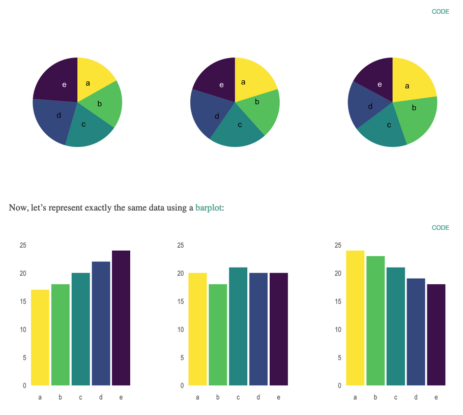{width=70%} 
> 
> [source de l'image](https://www.data-to-viz.com/caveat/pie.html)
>
> **2. Le barplot avec des barres d'erreur**
>
> Les barplots avec barre d'erreur permettent de représenter la moyenne d'une population (barplot) ainsi que 
> la dispersion des données (barre d'erreur). 
>
> Mais est-ce idéal pour montrer nos données? Discutez en avec votre voisin en vous aidant 
> de la figure ci-dessous extraite de
> [Weissgerber et al., 2015](https://journals.plos.org/plosbiology/article?id=10.1371/journal.pbio.1002128).
>
> {width=70%} 
> 


## Etre le plus près des données et ne pas cacher ou modifier les données étranges

De manière générale il est recommandé d'être au plus près des données quand nous réalisons des graphiques.

- Choisissez de présenter toutes vos données, sans les modifier ou en supprimer une partie (si vous le faites, vous devez expliquer ce que vous avez fait et pourquoi). 

- Idéalement, et si cela se prête à votre question, montrez les données plutôt que des résumés. Choisissez des nuages de points plutôt que des barplots avec des barres d'erreur. 

- Toujours indiquer la taille des effectifs, soit en l'écrivant dans le graphique, soit en le rendant visible (nuage de point, densité etc)

Pour aller plus loin, nous allons regarder de plus prêt deux cas en particulier:

#### 1. Comparer des distributions

Pour rappel, le boxplot permet de montrer un bon résumé des données:
{width=70%} 

[source de l'image](https://www.leansigmacorporation.com/box-plot-with-minitab/)


Cependant, faire un résumé des données peut cacher des informations:

- effectifs de différente taille dans certains groupes
- distribution unimodale vs bimodale

<br>

Des alternatives existent pour représenter les données, afin d'éviter ces problèmes:

- Si vous n'avez pas trop de points, vous pouvez les représenter au dessus des boxplots:
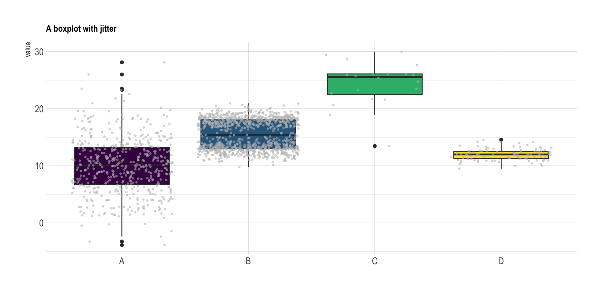{width=70%} 

[source de l'image](https://www.data-to-viz.com/caveat/boxplot.html)

- Si vous avez trop de points pour les représenter dans le graphique, vous pouvez utiliser un violin plot  en indiquant la taille de l'effectif de chaque groupe:

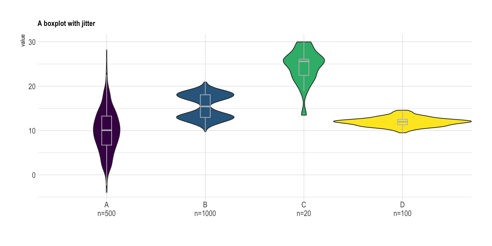{width=70%} 

[source de l'image](https://www.data-to-viz.com/caveat/boxplot.html)

#### 2. Axes coupés ou non?

Si vous avez des données numériques avec des valeurs très éloignées de zéro il peut être tentant de ne pas faire commencer l'axe y à zéro mais plus proche de vos valeurs. Attention, cela peut cependant changer la conclusion!

Voici un exemple avec deux graphiques, l'un avec l'axe des y commençant à zéro et l'autre non. Le deuxième peut donner l'impression qu'il y a une grande différence entre les deux groupes, même si ce n'est pas forcement le cas.


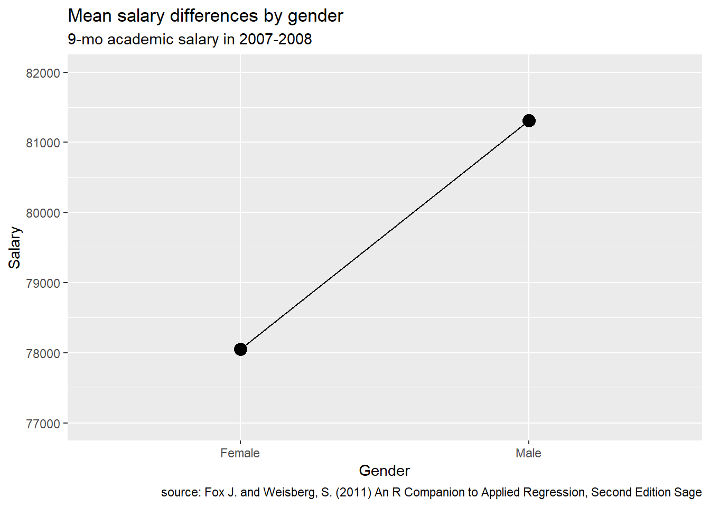{width=70%} 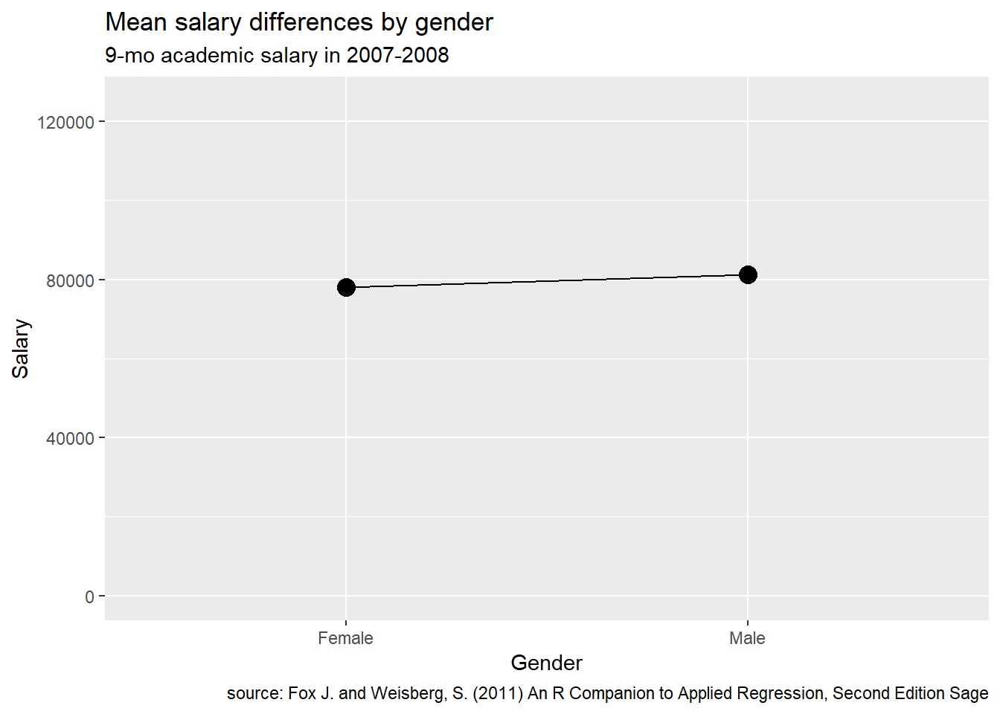{width=70%}

[source des images](https://rkabacoff.github.io/datavis/Advice.html)


De manière générale:

- Si vous utilisez des barplots ou des points avec différentes catégories à comparer, faites commencer l'axe y à zéro.

- Si vous utilisez des lignes (comme dans le cas de séries chronologiques), il n'est pas nécessaire de faire commencer l'axe des y à zéro. En effet ce type de graphique permet de montrer l'évolution d'une observation par exemple au cours du temps. Alors que les barplots sont utilisés pour montrer la différence entre deux (ou plusieurs) groupes


<br>

Si vous avez des données numériques avec certains points très éloignés des autres il peut être tentant de couper l'axe y entre les groupes de points. Ne le faites jamais!! Il existe d'autres alternatives comme par exemple utiliser une échelle logarithmique. 


## Comment bien faire ressortir le message des graphiques

Maintenant que nous avons vu les erreurs à éviter quand nous créons des graphique, passons aux méthodes permettant de bien faire ressortir le message des graphiques. Cela permettra de faciliter l'interprétation des graphique. 

De manière générale, évitez de faire des graphiques trop compliqués avec des fioritures. Évitez la 3D, les axes doubles et les lignes de grille. Concentrez vous sur l'essentiel! 

Voyons trois méthodes plus en détail:


#### 1. Ordonnez les données

Par défaut, R va ordonner les catégories de vos variable par ordre alphabétique. Sur excel, l'ordre des variable dans le tableau est utilisé. Cependant cet ordre n'est pas toujours optimal.

Vous pouvez changer l'ordre des catégories de vos variables sur R (nous verrons comment en séance 5). Voici quelques conseils pour bien choisir l’ordre dans lequel représenter les données.

- Si vous comparez des données pour un (ou des) mutant à un wild type, ou si vous comparez un (ou plusieurs) traitement à un contrôle, **commencez toujours par la référence**, c.a.d le wild type ou le contrôle.

- S'il n'y a pas de référence (wild type ou contrôle) et que vous voulez comparer différents conditions, dans ce cas **ordonnez vos catégories en fonction de leur valeur**, par exemple du plus grand au plus petit. Cela permettra facilement d'identifier les catégories avec les valeurs les plus grandes ou plus petites, ou les catégories avec des valeurs similaires.
Voici un exemple d'un graphique avec des catégories non ordonnées, puis avec des catégories ordonnées. La version avec les catégories ordonnées est beaucoup plus facile à interpréter.


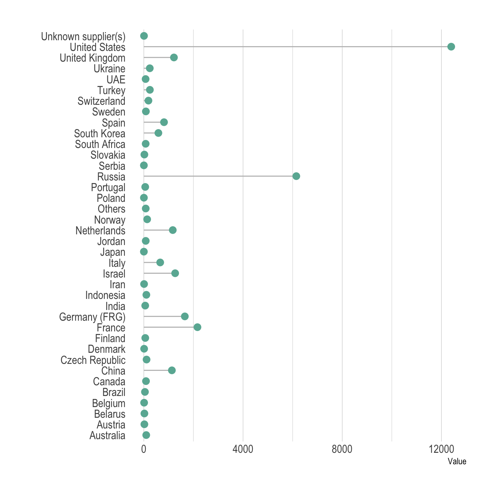{width=60%}
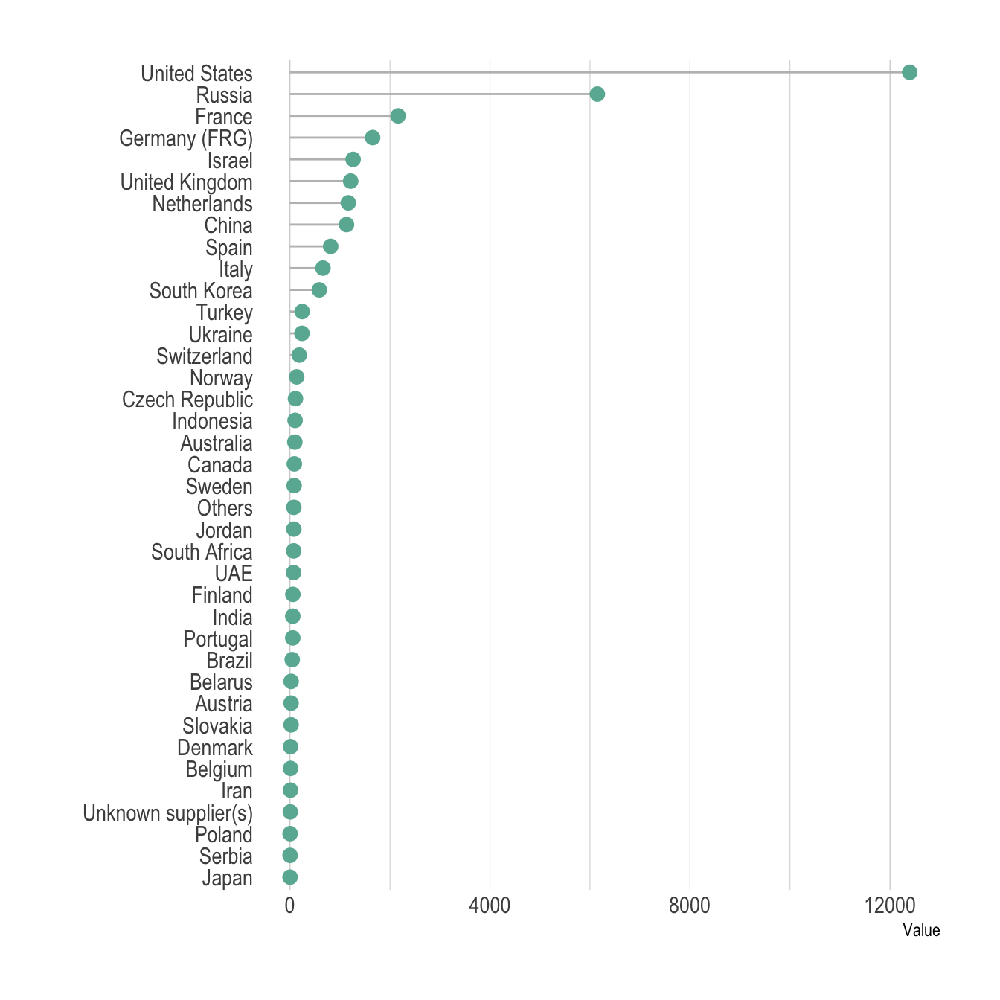{width=60%}


[source des images](https://www.data-to-viz.com/caveat/order_data.html)


#### 2. Évitez de mettre trop d'information dans vos graphiques

Il est tentant de vouloir faire rentrer toutes vos données dans un même graphique, surtout qu'avec R vous pouvez jouer avec les couleurs, les formes et la taille des points. Mais pour que le message ressorte bien, il vaut mieux présenter moins de données et se concentrer sur **un message par graphique**. 


- Pour des graphiques avec des lignes, montrer plus de quelques (5?) lignes peut rendre le graphique illisible. Sauf si vous voulez montrer que toutes les lignes se comportent de la même manière.

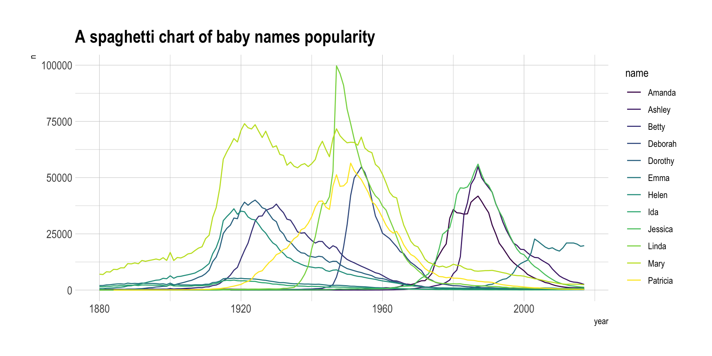{width=90%}

Pour éviter ce problème, vous pouvez faire un graphique par ligne, ou mettre en valeur une ligne en particulier.

{width=60%}
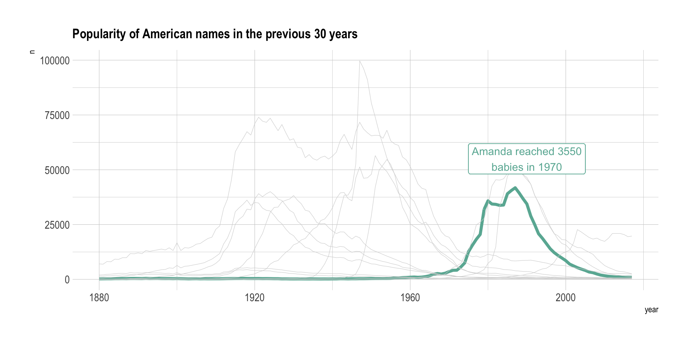{width=80%}

[source des images](https://www.data-to-viz.com/caveat/spaghetti.html)

<br>
<br>

- Pour les graphiques avec des points, si vous avez trop de points il est difficile de bien l'interpréter. 


Pour inclure l'information de la densité en points vous pouvez utiliser la transparence des points, ou montrer la densité en 2D ou 3D

Graphique avec trop de points cachant la densité

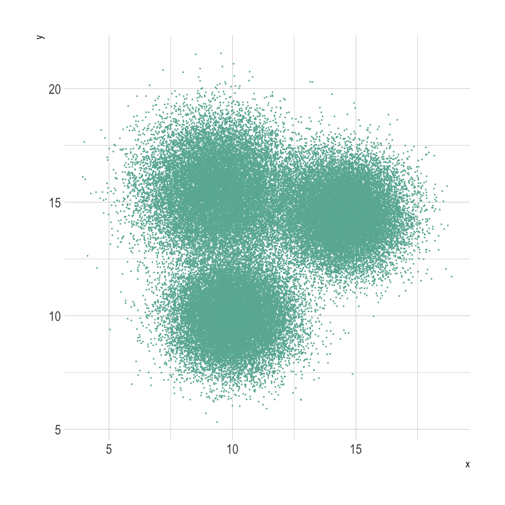{width=50%}

Graphique avec une densité 2D

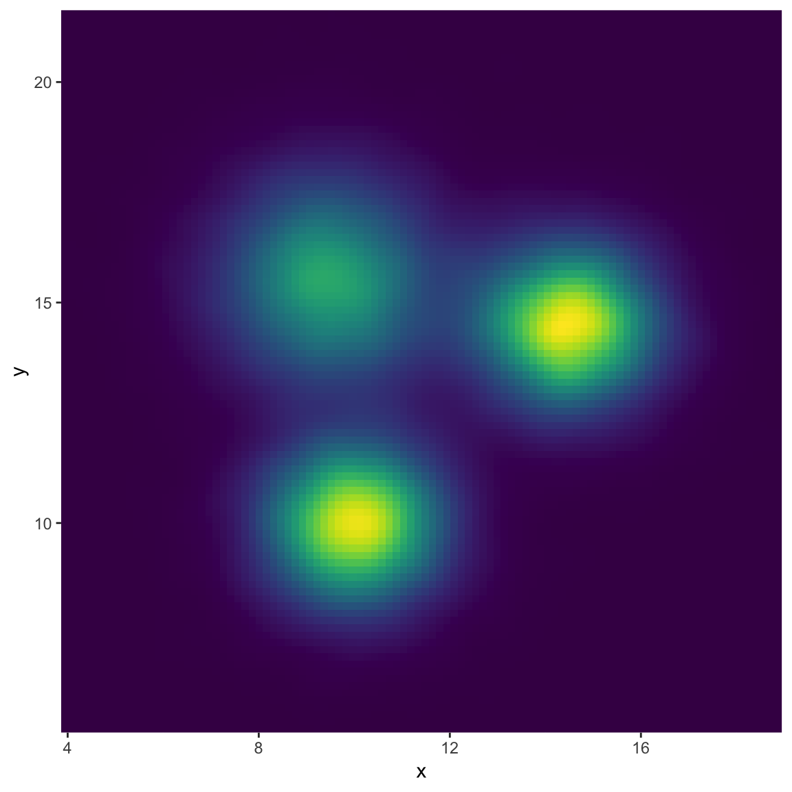{width=50%}

Graphique avec une densité 3D

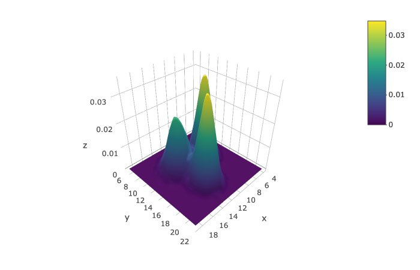{width=60%}

[source des images](https://www.data-to-viz.com/caveat/overplotting.html)


#### 3. Bien utiliser les couleurs 

Un avantage de ggplot est qu'il offre une large palette de couleur. 
Il existe d'ailleurs la libraire `RColorBrewer` qui contient de nombreuses palettes prédéfinies qui vous aideront beaucoup. 

```{r  echo=FALSE, message=FALSE, warning=FALSE}

library(RColorBrewer)

```

Voici toutes les palettes de couleur de `RColorBrewer`


```{r  echo=FALSE, message=FALSE, warning=FALSE}

display.brewer.all()

```


Surtout vous pouvez facilement y sélectionner les palettes de couleurs qui sont aussi visibles pour les daltoniens avec la commande:


```{r  }

display.brewer.all(colorblindFriendly = TRUE)

```


Maintenant que nous avons accès à toutes ces couleurs, encore faut-il bien les utiliser. 

> **Discussion de groupe**
>
> Discutez avec votre voisin des graphiques suivant. 
>
> A votre avis, lesquels font une bonne ou une mauvaise utilisation des couleurs? Pourquoi?
> (chaque exemple contient 2 graphiques)
>
> Exemple 1
> 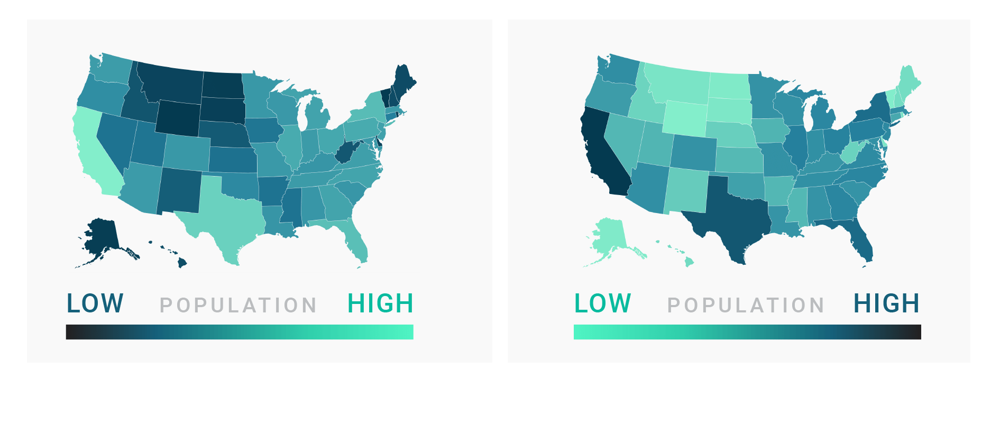
>
> Exemple2
> 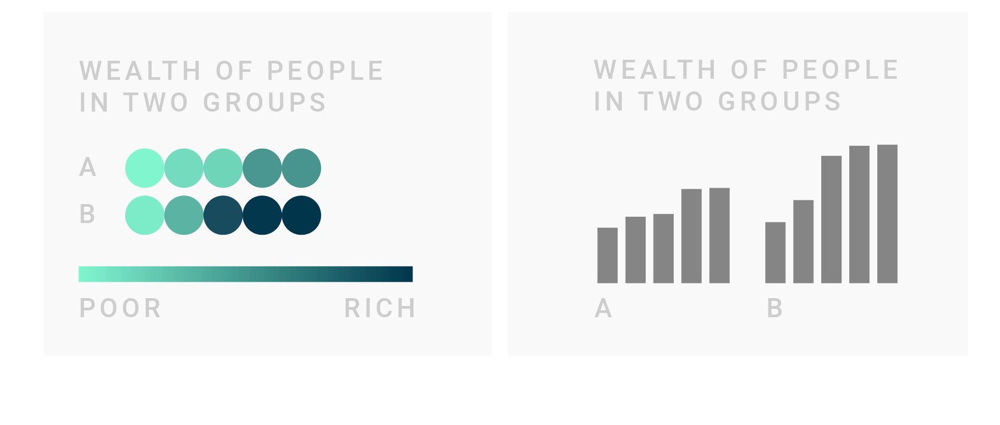
>
> Exemple 3
> 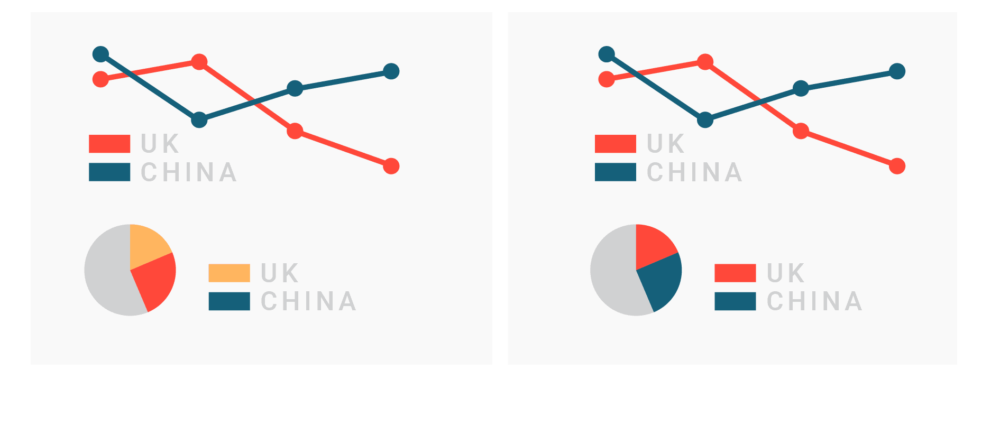
>
> [source des graphiques](https://blog.datawrapper.de/colors/)


Voici quelques conseils pour que la couleur dans les graphiques soit votre alliée et non l'inverse.

- **N'utilisez des couleurs que si cela est nécessaire** au graphique et ajoute des informations. Sinon cela va juste créer une distraction et compliquer le graphique. Vous pouvez utiliser des couleurs pour représenter différents groupes, montrer un gradient ou insister sur certains points.
De même ne colorez pas le fond des graphiques.

- **N'utilisez pas plus de 7 couleurs dans un graphique**, sinon cela va créer de la confusion. Dans ce cas, choisissez un autre type de graphique qui permet de réduire le nombre de couleurs utilisées.

- Si vous avez plusieurs graphiques qui contiennent les même variables, **soyez cohérent** et utilisez toujours les même couleurs pour ces variables.

- **Assurez vous d'avoir une légende** qui indique à quoi correspondent les couleurs et mettez la au même endroit pour tous vos graphiques.

- Si vous avez des données moins importantes dans un graphique, colorez les en gris et n'utilisez de la couleur pour les données que vous voulez faire ressortir. 

- Assurez vous qu'il y a assez de contraste entre vos couleurs dans un graphique. Et aussi entre le texte et le fond pour que le texte soit bien lisible.

- **Certaines couleurs sont associées à des idées dans notre culture**. Par exemple le rouge pour _non_ ou _mauvais_ et le vert pour _oui_ ou _bon_. Allez dans ce sens pour rendre vos graphiques plus faciles à lire. 

- Si vous utilisez un gradient, **associez les couleurs claires aux faibles valeurs et les couleurs foncées aux valeurs élevées**. Par contre n'utilisez pas de gradients de couleurs pour des catégories, gardez les pour des valeurs numériques.

Vous pouvez trouver des exemples de chaque cas et quelques points supplémentaires [ici](https://blog.datawrapper.de/colors/)


# Ressources et liens utiles

- [Aide au choix du type de graphique](https://www.data-to-viz.com/)
- [Les erreurs à éviter lors de la création de graphiques](https://www.data-to-viz.com/caveats.html)
- [Antisèche pour faire des graphiques intéractifs](https://images.plot.ly/plotly-documentation/images/r_cheat_sheet.pdf)


-------

[Retour à la page d'accueil](https://scortijo.github.io/2022_L3_R/)

