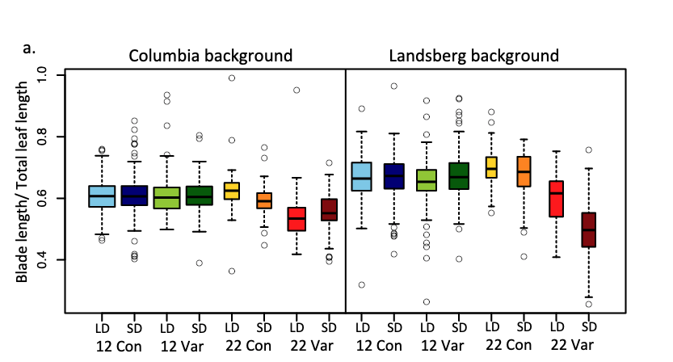

```{r setup, include=FALSE}
knitr::opts_chunk$set(echo = TRUE)
```

[Retour à la page d'accueil](https://scortijo.github.io/2022_L3_R/)

<br>

Dans cette partie du cours vous allez apprendre à **restructurer des tables dans R**. 
Ces changement sont parfois nécessaire pour mettre les données dans le format adapté au graphique que vous voulez réaliser.


Aujourd’hui nous allons voir comment:

1. Combiner une filtration de lignes avec un graphique

2. Ajouter ou modifier des colonnes

3. Concaténer ou séparer des colonnes


<br>

# Mise en place

Tout d'abord, créez un nouveau _script R_ et préparez votre environnement de travail:


```{r}
# Chargez la librairie `tidyverse`

# Changez votre répertoire de travail pour être dans `session3_plots_reorganisation`

# Importer `burghardt_et_al_2015_expt1.txt` et mettez le dans un objet appelé `expt1`

```


```{r,  eval = TRUE,message=FALSE, echo=FALSE}
# Chargez la librairie `tidyverse` (aide: utilisez la fonction `library()`)
library(tidyverse)

# Importer `burghardt_et_al_2015_expt1.txt` et mettez le dans un objet appelé `expt1`
#(aide: utilisez la fonction `read_tsv()`)

expt1 <- read_tsv("../data/burghardt_et_al_2015_expt1.txt")

```

<br>


# Combiner des sélections de lignes avec un graphique

Afin de pouvoir combiner la sélection de données avec un graphique, nous devons d'abord apprendre à faire des chaines de commandes.

## Créer des chaînes de commandes avec les pipes `%>%`  

Les "pipes" (`%>%`) permettent de faire une séquence d'opération sur des données, sans avoir besoin de créer des objets intermédiaires (ou de faire des commandes imbriquées très compliquées)


Imaginons que nous voulions faire les sélections suivantes sur notre table:

- Filtrer des données pour ne garder que les plantes qui ont été vernalisées

- Ne garder que deux colonnes: le génotype et la taille totale des feuilles


Grace au symbole `%>%` pipe, nous pouvons créer une chaîne de commandes. Pour cela nous devons d'abord faire une commande et ajouter `%>%` à la fin de la ligne qui va utiliser le résultat de cette commande comme input pour la fonction à la ligne suivante. 
Voici comment faire:


```{r}
expt1 %>% 
  filter(vernalization == "V") %>% 
  select(genotype, total.leaf.length.mm)
```


> **Exercice 1:**
> Utilisez `%>%` pour faire la suite de sélections suivantes sur `expt1`:
>
> - Gardez les plantes qui _ne sont pas_ du background Ler, et qui ont été traitées avec la température fluctuante. 
> - Ne gardez que les colonnes qui contiennent le génotype, la longueur de "blade" et des information sur le "bolting" 

<br>

> **BONUS**: Transformez l'enchainement de commandes afin d'utiliser des pipes `%>%` plutôt que objets intermédiaires
> 


```{r, message=FALSE}

expt1 <- read_tsv("../data/burghardt_et_al_2015_expt1.txt")

expt1_filtered <- filter(expt1, fluctuation=="Con" & day.length=="16")

expt1_selected <- select(expt1_filtered,days.to.bolt:total.leaf.length.mm)

summary(expt1_selected)

```


## Combiner avec un graphique 

Avec le pipe nous pouvons aussi utiliser l'output d'une commande (ou d'une chaîne de commandes) comme un input pour `ggplot` afin de faire un graphique sur les données sélectionnées.
Ceci est très utile lors de la phase d'exploration des données (sans avoir à créer de nouveaux objets avec en permanence `<-`).

Nous pouvons par exemple faire un box plot pour le temps de floraison en fonction de la fluctuation de température, mais celle fois uniquement pour les plantes qui ont été vernalisées:


```{r, warning=FALSE}
expt1 %>% 
  filter(vernalization == "V") %>% 
  ggplot(aes(fluctuation, days.to.flower)) + 
  geom_boxplot()
```

> **Exercice 2:**
> Faite un violon plot du temps de floraison pour les différents génotypes, mais uniquement pour les plantes ayant poussées en jours court (8h de lumière).
>
> Aide: Utilisez `filter()` pour sélectionner les données et ensuite un pipe (`%>%`) pour utiliser l'output pour le graphique.
>
>


> **BONUS**
>
> Représentez, uniquement pour les plantes qui contiennent le mot "Col" dans le background, et qui ont poussée à 22°C, un box plot de _days.to.bolt_ en fonction du _day.length_, coloré en fonction de la _fluctuation_. Séparez les graphiques pour avoir une facet par _génotype_. Utilisez un thème de type _theme_bw_.
>
>
> **Interprétez le résultat** Est-ce que le temps de floraison de certains génotypes est affecté par la fluctuation de température. Si oui lesquels?


<br>


# Modifier ou ajouter des colonnes avec `mutate()`

La fonction `mutate()` permet d'ajouter de nouvelles variables (i.e. nouvelles colonnes) dans une table, ou de modifier des colonnes déjà existantes.


{width=70%}

[source de l'image](https://github.com/allisonhorst/stats-illustrations)


Par exemple, ajoutons une colonne `leaf.length.cm` qui va contenir la longueur des feuilles en cm. Pour cela nous devons créer une nouvelle colonne en utilisant la colonne `leaf.length.mm` qui existe dans la table.


```{r}
# Créez une nouvelle table avec la colonne supplémentare  
expt1.cm <- mutate(expt1, total.leaf.length.cm = total.leaf.length.mm/10)

# Vérifier que la nouvelle colonne est bien là
colnames(expt1.cm)
```

Nous pouvons aussi créer et modifier plus d'une colonne à la fois, en les séparant par une virgule (`,`) dans la fonction `mutate()`:

```{r}
# Créez deux nouvelles colonnes
expt1.cm <- mutate(expt1, 
                   blade.length.cm = blade.length.mm/10,
                   total.leaf.length.cm = total.leaf.length.mm/10)

# Vérifier que les nouvelles colonnes sont bien là
colnames(expt1.cm)
```

**Attention!!** Si vous utilisez le nom d'une colonne déjà existante, vous allez la modifier et non créer une nouvelle colonne.


> **Exercice 3:**
>
> Créez une nouvelle colonne "blade.ratio" avec le ratio de `blade.length.mm` et `total.leaf.length.mm`
>

> **BONUS:**    
> Créez une nouvelle colonne "late.flowering" qui contient `TRUE` si days.to.bolt est supérieur à 70, et `FALSE` days.to.bolt est inférieur à 70.   
> *Aide*: Trouvez la solution en utilisant google


<br>


# Concaténer ou séparer des colonnes avec `unite()` et `separate()`

<br>

Pour concaténer deux ou plusieurs colonnes ensemble, utilisez la fonction `unite()`. Par exemple, pour concaténer `vernalization`, `survival.bolt` et `bolt`:


```{r}
# Créez deux nouvelles colonnes
expt1.concatenated <- unite(expt1, "Vern_survival_bolt",vernalization,bolt.survival,bolt)

# Vérifier que la nouvelles colonnes sont bien là
colnames(expt1.concatenated)
```


A contrario, pour séparer une colonne en deux ou plusieurs colonnes, utilisez la fonction `separate()`. Par exemple, pour séparer la colonne `barkground` :


```{r warning=FALSE}
# Créez deux nouvelles colonnes
expt1.separated <- separate(expt1, background, into=c("genotype", "FRI mutation"))

# Vérifier que la nouvelles colonnes sont bien là
colnames(expt1.separated)
```


<br>

-------


> **Exercice 4:** 
> 
> Reproduisez cette figure de [Burghard et al 2015](https://nph.onlinelibrary.wiley.com/doi/full/10.1111/nph.13799)
> 
> 
> 
> 
> Aide: 
> 
> - Créez une nouvelle colonne (blade.ratio) avec le ratio de `blade.length.mm` et `total.leaf.length.mm`
> 
> - Créez une nouvelle colonne (nommée par exemple `condition`) en concaténant `day.length`, `temperature` et `fluctuation`
> 
> - Sélectionnez les background  `Col ` et `Ler`
> 
> - Faites un boxplot du ratio de `blade.length.mm` et `total.leaf.length.mm` en fonction de la `condition`, en créant des facets en fonction du background
> 
> - Pas besoin de mettre de la couleur qui n'apporte rien au graphique
>
> - N'essayez pas de reproduire l'ordre des conditions (sur l'axe x). Nous verrons comment le faire à la prochaine séance

>
> **BONUS**: Ce bonus vous permettra d'avoir des valeurs de x plus proches du graphique
>
> - Avant de créer la nouvelle colonne en concaténant `day.length`, `temperature` et `fluctuation`, créer une colonne `LD.SD` dans laquelle vous aurez "LD" à la place de la valeur "16" de la colonne `day.length`, et "SD" à la place de la valeur "8" de la colonne `day.length`. Utilisez ensuite cette colonne `LD.SD` pour la concaténation avec `temperature` et `fluctuation` pour créer la colonne  `condition`
> - Changez le thème du graphique pour enlever la grille et avoir un fond blanc.

<br>

<br>


<br>

## Ressources et liens utiles:

- [antisèche pour la réorganisation de données](https://www.rstudio.com/wp-content/uploads/2015/02/data-wrangling-cheatsheet.pdf)
- [Chapitre sur la réorganisation de données du livre 'R for Data Science'](http://r4ds.had.co.nz/transform.html)


<br>

******
  
#   <span style="color: blue;">Contrôle continu à faire pour la prochaine séance </span>

#### A partir ce ce que nous avons vu aujourd'hui:

#### - Commencez la deuxième moitié du contrôle continu dont les instructions sont [ici](Devoir_seance4.html)


******


[Retour à la page d'accueil](https://scortijo.github.io/2022_L3_R/)


