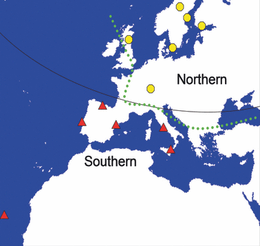

```{r setup, include=FALSE}
knitr::opts_chunk$set(echo = TRUE)
```


# Consignes générales

<br>

**Téléchargez le dossier Exam_blanc dans Moodle qui contient:**

**- Un fichier `Exam_blanc.html` qui contient l'énoncé de l'exam blanc (une copie de cet énoncé) **

**- Un fichier `Exam_blanc.R` qui contient le script R dans lequel vous allez mettre vos scripts et réponses aux questions**

**- Un dossier `data` qui contient les données**

<br>

**Ouvrez `Exam_blanc.R` et sauvez le dans le même dossier sous le nom `Exam_blanc_numéro_étudiant.R` en remplaçant `numéro_étudiant` par votre propre numéro.** 

<br>

**Pour chaque question, dans le fichier `Exam_blanc_numéro_étudiant.R`:**

**- Commentez le code (en utilisant #) pour expliquez ce que vous allez faire et pourquoi vous utilisez telle ou telle fonction**

**- Utilisez des commandes appropriées pour répondre à la question**

**- Et finalement répondez (en commentant avec un #) à la question grâce au résultat des commandes**

<br>

<span style="color: red;">**L'exam blanc fini à 9h30. Quand vous avez fini, déposez votre script `Exam_numéro_etudiant.R`, ainsi que le screenshot de ePlant dans l'espace de dépôt Moodle. Avant de sortir de la salle, vérifiez auprès de Sandra Cortijo que les fichiers ont bien été déposés.** </span>

<br>

**N'oubliez pas d'enregistrer régulièrement `Exam_blanc_numéro_étudiant.R` pendant l'exam.**

<br>

# Description des données

Pour l'examen, vous allez analyser des données extraites de [Chiang et al., 2011](https://onlinelibrary.wiley.com/doi/10.1111/j.1365-294X.2011.05181.x). 

Il s'agit de données issues d'expériences pour mesurer l'expression de gènes contrôlant la germination chez *Arabidopsis thaliana*. Pour cela, des plantes génétiquement différentes les unes des autres (variable `Ecotype`), ont été mises à germer sous le design expérimental suivant : 

+ Différents traitements en longueur de jours et en température pour la plante qui produit les graines : "LW" (long day, warm), "SW" (short day, warm), "SC" (short day, cold). Cette variable est nommée `SeedMaturation.`

+ Les écotypes (variable `Ecotype`) choisis sont originaires d'une localisation du "Nord" ou du "Sud" de l'Europe, pour étudier l'effet de la géographie sur la germination (variable `Geography`).


Illustration de la provenance des écotypes de l'étude: 

Source: [Chiang et al., 2011](https://onlinelibrary.wiley.com/doi/10.1111/j.1365-294X.2011.05181.x)

+ Différents stades de développement de la silique (capsule entourant les graines) ont été analysés :"Early" et "Late", encodés dans la variable `SiliqueDevelopmentalStage.`


+ L'expression de deux gènes d'intérêt pour la germination, DOG1 et NCED9, normalisée par un gène contrôle, sont rapportés dans chacune des combinaisons des variables précédentes. 

La normalisation a été effectuée avec la formule suivante:

$$
log_2(\frac{\text{expression du gène d'intérêt}}{\text{expression du gène contrôle}})
$$

Cette normalisation des données est utilisée car : 

- La division par l'expression du gène contrôle permet de s'affranchir de biais expérimentaux

- Le passage au log permet de resserrer la distribution des valeurs d'expression, qui serait sinon étalée vers des valeurs trop extrêmes. Entre autre, cela permet de faire des visualisations plus claires. 

Les valeurs obtenues sont centrées autour de zéro. Pour chaque gènes:

- Les **valeurs positives** indiquent une expression **supérieure** au gène contrôle

- Les **valeurs négatives** indiquent une expression  **inférieure** au gène contrôle

<br>

+ Enfin, plusieurs mesures dans des conditions identiques sont réalisées, c'est ce que représente la variable `Replicate`.

<br>

<br>

# Préparation de l'environnement de travail

## Question 0


> **Chargez les librairies dont vous aurez besoin.** 

> **Définissez le working directory de R pour être dans le dossier de l'exam.** 

> **Chargez le fichier _DOG1_Expression_clean.txt_ (qui est dans le dossier _/data_), qui contient les données d'expression, dans R et sauvez le dans un objet.**

> *Aide: Utilisez la fonction appropriée pour le type de données (dans ce cas, des colonnes séparées par une tabulation)*


> Pensez à inspecter ce que retourne cette commande dans la console pour avoir un tout premier aperçu des données et vérifier qu'elles sont encodées correctement.

<br>


# Vérification des données

> Avant d'analyser les données, la première étape consiste à vérifier que le tableau importé dans _R_ contient bien les données attendues.


## Question 1


> **Y a t il des valeurs manquantes dans les données? Comment le voyez vous?**

<br>

## Question 2

> **Combien y-a-t-il d'écotypes différents? Donnez la liste des écotypes**

<br>

<br>

# Etude de l'expression de gènes d'intérêt pour la germination

<br>

## Question 3


> **Faites une figure représentant les niveaux d'expression de DOG1 suivant le stade de développement des siliques, l'origine géographique, et les conditions de maturation des graines, et ce uniquement pour des plantes ayant poussé en jours courts à température élevée.**
>
> **Pour cela, filtrez les données pour garder seulement la condition de maturation "SW", puis montrez les niveaux d'expression normalisée de DOG1 et de NCED9 en fonction de la provenance géographique des plantes. Nous souhaitons une représentation en boxplots colorés suivant le stade de développement des siliques, et une sous figure par gène.**


> *Aide : Pour réaliser ce graphe, commencez par filtrer les observations pour garder la condition de maturation "SW". Changez le format du tableau pour passer au format long avec une colonne contenant le nom du gène et une colonne contenant les valeurs d'expression. Puis, réalisez le graphique demandé avec des boxplots de l'expression des gènes, en fonction de la provenance géographique, colorés en fonction du stade de développement des siliques, et avec le gène en facet.*

<br>

<br>

<br>

> **Formulez une interprétation complète de ce que nous apprend  cette figure quant à l'influence de la géographie, et du stade de développement sur l'expression de nos gènes d'intérêts.**

<br>

<br>

## Question 4

<br>

> **Pour vérifier si cet effet est observé pour tous les génotypes, mesurez la moyenne de l'expression normalisée de DOG1 aux deux stades de développement de la silique pour chaque génotypes, et ce uniquement pour des plantes ayant poussé en jours courts à température élevée.**
>
> *Aide : Pour cela, commencez par filtrer les observations pour garder la condition de maturation "SW". Groupez les échantillons en fonction de l'écotype et du stade de développement de la silique. Et enfin calculez la moyenne de l'expression de DOG1 pour chaque groupe.*

<br>

<br>

> **Observez vous une différence d'expression en fonction du stade de développement de la silique pour tous les écotypes? **
>
>**Y a t'il des écotypes pour lesquels la différence est faible? Si oui, lesquels? **

<br>


# Etude du gène DOG1 en utilisant une base de donnée

<br>

## Question 5

> Compte tenu des résultats obtenus jusqu'ici, DOG1 semble être un gène qui peut être important dans la germination des graines d'*Arabidopsis thaliana*.
> En utilisant l'application [ePlant](https://bar.utoronto.ca/eplant/) de BAR de l'Université de Toronto trouvez les informations suivantes sur le gène DOG1:


<br>


> **- Quel est le numéro unique de DOG1 (du format AT1G12345)?**

<br>

> **- Dans quel tissu de la plante est ce que le gène DOG1 est exprimé? Faites un screenshot de la figure de ePlant qui vous a permis de répondre et envoyez le par mail en même temps que votre script R. **
>
> *Aide: Utilisez le Plant eFP viewers. Pour prendre un screenshot, utilisez les touches `fn` et `impr ecran` de votre clavier et sauvez la capture d'écran au format png*


<br>

<span style="color: red;">**Fin de l'exam. N'oubliez pas de vous relire, et déposez votre script `Exam_numéro_etudiant.R`, ainsi que le screenshot de ePlant dans l'espace de dépôt Moodle. Avant de sortir de la salle, vérifiez auprès de Sandra Cortijo que les fichiers ont bien été déposés. ** </span>


